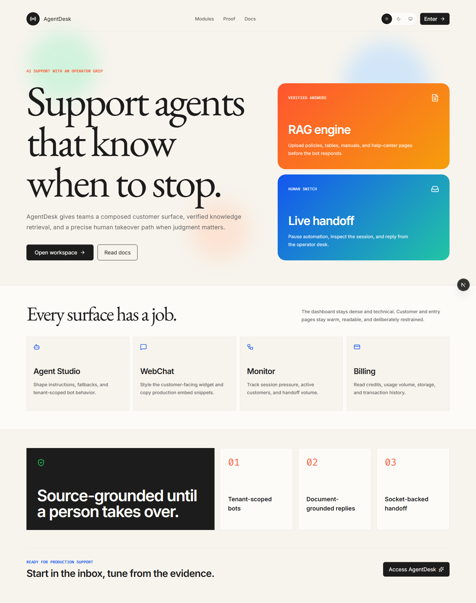
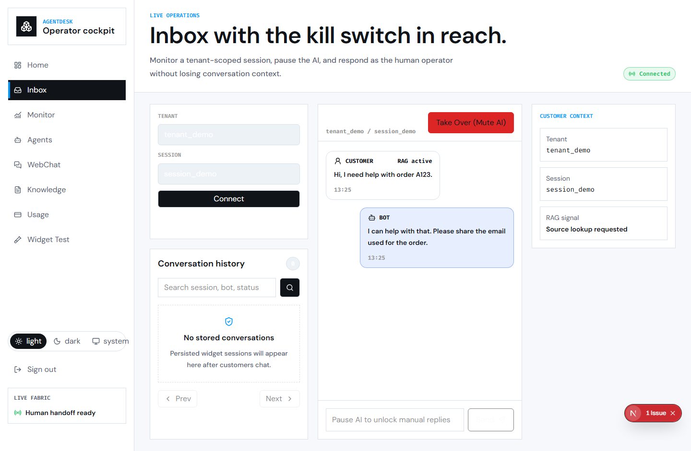
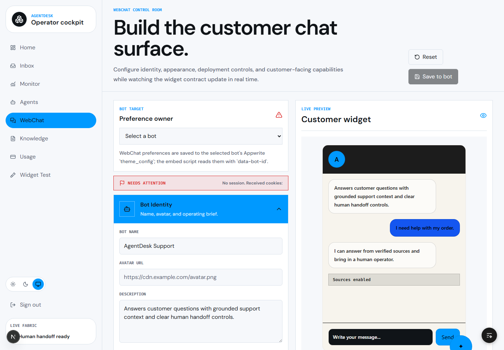
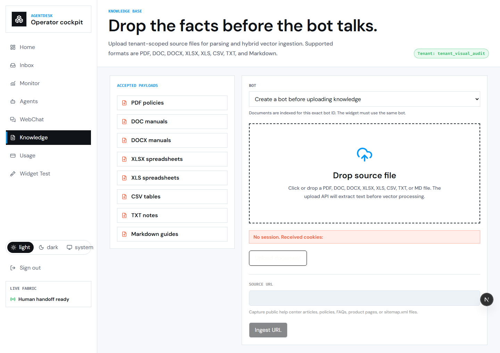
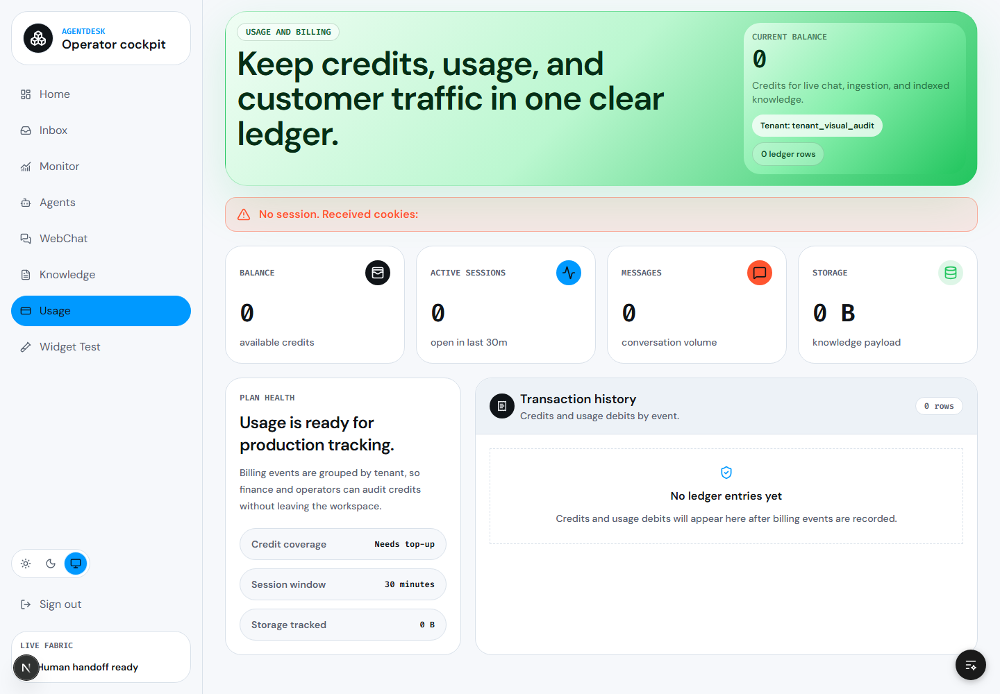
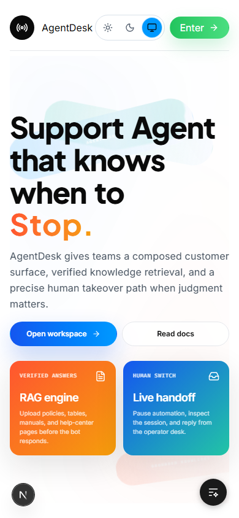
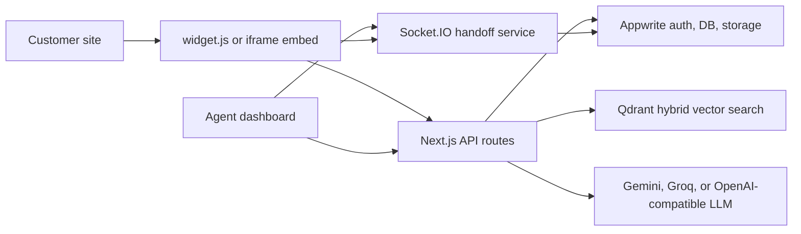

# AgentDesk

AgentDesk is a multi-tenant AI customer support workspace for teams that need grounded answers, embeddable WebChat, live human handoff, and credit-aware usage tracking in one product.

<p align="center">
  <a href="https://agentdeskbot.vercel.app">Live Demo</a>
  |
  <a href="https://agentdeskbot.vercel.app/docs">Hosted Docs</a>
  |
  <a href="https://github.com/Purushotham-Prajapati-24/AgentDesk/issues">Report an Issue</a>
</p>

<p align="center">
  
  
  
  
  
  
  
</p>

## Product Snapshots

The screenshots below are generated from the current UI and stored in `public/readme-screenshots/`.

| Landing page | Live inbox and handoff |
| --- | --- |
|  |  |

| WebChat customizer | Knowledge ingestion |
| --- | --- |
|  |  |

| Billing and usage | Mobile landing page |
| --- | --- |
|  |  |

## What AgentDesk Does

| Area | Capability |
| --- | --- |
| AI support agents | Create tenant-scoped bots with identity, instructions, fallback behavior, and advanced WebChat configuration settings. |
| WebChat customization | Customize widget surface, headers, input boxes, typography, colors, custom CSS overrides, and custom launcher icon settings in the visual customizer dashboard. |
| Safe Markdown parsing | Cleanly format headings, lists, links, emphasis, and inline code in chat responses using an in-house safe compiler to avoid formatting leakage and raw asterisks. |
| Retrieval grounded answers | Upload documents or ingest URLs, chunk source material, embed content, and retrieve context from Qdrant before generation. |
| WebChat deployment | Ship a Shadow DOM widget with a single script tag or embed a full chat surface with an iframe (with custom guide snippets for React and Vue). |
| Live handoff | Route active sessions into a Socket.IO powered operator inbox, pause automation, and reply as a human agent. |
| Monitoring | Review users, conversations, active sessions, escalation pressure, and persisted transcripts. |
| Usage control | Track credits, token spend, ledger activity, message volume, and tenant balances. |
| Developer surface | Use public chat, ingestion, widget config, and WebChat configuration APIs. |

## Architecture



Runtime flow:

1. A customer message enters through the embedded widget or iframe route.
2. The chat API validates tenant, bot, session, credit, and safety constraints.
3. The message is embedded and searched against tenant-scoped Qdrant chunks.
4. Retrieved source context is passed to the selected LLM provider.
5. The response streams back with Server-Sent Events.
6. Conversation state, messages, and credit ledger entries are persisted in Appwrite.
7. If an operator pauses automation, Socket.IO keeps the conversation live without triggering RAG generation.

## Tech Stack

| Layer | Implementation |
| --- | --- |
| Web app | Next.js 16 App Router, React 19, TypeScript |
| Styling | Tailwind CSS 4, custom UI primitives, Lucide icons |
| Auth and persistence | Appwrite Cloud, `appwrite`, `node-appwrite` |
| Retrieval | Qdrant Cloud hybrid collection |
| Document parsing | `mammoth`, `unpdf`, `xlsx`, `jsdom`, Readability, Turndown |
| Generation | Gemini by default, with Groq and OpenAI-compatible fallback support |
| Realtime | Socket.IO service in `websocket-server/` |
| Widget | React-based custom element bundled into `public/widget.js` |
| Verification | ESLint, Node test runner, Playwright |

## Repository Layout

```text
src/
  app/
    (auth)/                  Magic-link login and verification
    (dashboard)/             Protected dashboard routes
    api/                     Chat, ingestion, widget, and WebChat APIs
    docs/                    Public documentation route
    embed/[botId]/           Iframe-compatible chat surface
  components/                Shared UI and product components
  context/                   Auth, tenant, theme, and WebChat providers
  lib/
    server/                  Appwrite admin, parsers, embeddings, retrieval, Qdrant, LLM providers
    credits.ts               Credit ledger helpers
  types/                     Shared declarations
widget/                      Embeddable widget source and framework adapters
websocket-server/            Standalone Socket.IO handoff service
scripts/                     Appwrite and Qdrant provisioning helpers
public/readme-screenshots/   README screenshot assets
test/                        Node test runner suites
```

## Getting Started

### Prerequisites

- Node.js 20.9 or newer
- npm
- Appwrite project with database, storage bucket, collections, and a server API key
- Qdrant cluster and API key
- Gemini API key
- Optional Groq or OpenAI-compatible key for fallback generation
- Optional Browserless key for JavaScript-heavy URL ingestion
- Optional Upstash Redis for durable websocket state and clustered Socket.IO pub/sub

### Install

```bash
git clone https://github.com/Purushotham-Prajapati-24/AgentDesk.git
cd AgentDesk
npm install
```

### Configure `.env.local`

Create `.env.local` in the repository root. Keep real secrets out of version control.

Fill in your credentials:

```env
# ── Appwrite ────────────────────────────────────────────────────────
NEXT_PUBLIC_APPWRITE_ENDPOINT=https://cloud.appwrite.io/v1
NEXT_PUBLIC_APPWRITE_PROJECT_ID=your-project-id
APPWRITE_API_KEY=your-server-api-key
NEXT_PUBLIC_APPWRITE_DATABASE_ID=agentdesk
APPWRITE_DATABASE_ID=agentdesk

NEXT_PUBLIC_APPWRITE_TENANTS_COLLECTION_ID=tenants
APPWRITE_TENANTS_COLLECTION_ID=tenants
NEXT_PUBLIC_APPWRITE_BOTS_COLLECTION_ID=bots
APPWRITE_BOTS_COLLECTION_ID=bots
NEXT_PUBLIC_APPWRITE_WEBCHAT_CONFIGS_COLLECTION_ID=webchat_configs
APPWRITE_WEBCHAT_CONFIGS_COLLECTION_ID=webchat_configs
NEXT_PUBLIC_APPWRITE_STORAGE_BUCKET_ID=documents
APPWRITE_DOCUMENTS_BUCKET_ID=documents
APPWRITE_DOCUMENT_FILES_COLLECTION_ID=document_files
NEXT_PUBLIC_APPWRITE_DOCUMENTS_COLLECTION_ID=document_files
APPWRITE_INGESTION_LOCKS_COLLECTION_ID=ingestion_locks
APPWRITE_SESSIONS_COLLECTION_ID=sessions
NEXT_PUBLIC_APPWRITE_SESSIONS_COLLECTION_ID=sessions
APPWRITE_MESSAGES_COLLECTION_ID=messages
NEXT_PUBLIC_APPWRITE_MESSAGES_COLLECTION_ID=messages
NEXT_PUBLIC_APPWRITE_LEDGER_COLLECTION_ID=ledger
NEXT_PUBLIC_APPWRITE_STORAGE_BUCKET_ID=<your-bucket-id>

QDRANT_URL=https://your-cluster.qdrant.io
QDRANT_API_KEY=your-qdrant-api-key
QDRANT_COLLECTION=agent_knowledge_base
QDRANT_COLLECTION_V2=agent_knowledge_base_v2
RAG_INDEX_VERSION=v2

GEMINI_API_KEY=your-gemini-api-key
GEMINI_CHAT_MODEL=gemini-2.0-flash
LLM_PROVIDER_ORDER=gemini,groq,openai
GROQ_API_KEY=
GROQ_CHAT_MODEL=llama-3.3-70b-versatile
OPENAI_API_KEY=
OPENAI_CHAT_MODEL=gpt-4.1-mini
OPENAI_COMPAT_API_KEY=
OPENAI_COMPAT_CHAT_URL=
OPENAI_COMPAT_CHAT_MODEL=

NEXT_PUBLIC_WEBSOCKET_URL=http://localhost:4000
WEBSOCKET_URL=http://localhost:4000

BROWSERLESS_API_KEY=
CREDIT_PER_TOKEN=0.001
```

The Qdrant scripts also accept the legacy names `ENPOINT_URL` and `API_KEY`.

### Provision Services

```bash
npm run setup:ingestion
npm run qdrant:hybrid
node --env-file=.env.local scripts/setup-webchat-configs.mjs
```

### Run Locally

Start the Next.js app:

```bash
# Terminal 1 — Next.js app
npm run dev

# Terminal 2 — Socket.IO WebSocket server (for live inbox)
npm run dev:ws
```

The app runs at `http://localhost:3000`. The websocket service defaults to `http://localhost:4000`.

For UI review without real Appwrite credentials, use the built-in visual audit mode:

```powershell
$env:NEXT_PUBLIC_VISUAL_AUDIT_MODE = "true"
npm run dev
```

---

## 🧩 Embedding the Widget

Script launcher:

```html
<script
  src="https://agentdeskbot.vercel.app/widget.js"
  data-bot-id="YOUR_BOT_ID"
  data-theme="webchat-v1"
  data-mode="launcher"
  async
></script>
```

Inline iframe:

```html
<iframe
  src="https://agentdeskbot.vercel.app/embed/YOUR_BOT_ID?theme=webchat-v1"
  title="AgentDesk Support"
  style="width: 100%; height: 640px; border: 0;"
></iframe>
```

After changing files under `widget/`, rebuild the compiled widget:

```bash
npm run build:widget
```

Do not edit `public/widget.js` directly; it is generated from `widget/`.

## 🔌 API Reference

| Method | Route | Purpose |
| --- | --- | --- |
| `POST` | `/api/chat/message` | Stream a RAG-grounded bot answer. |
| `POST` | `/api/v1/chat/message` | Versioned chat endpoint. |
| `POST` | `/api/documents/upload` | Store uploaded document metadata and file references. |
| `POST` | `/api/documents/url` | Queue URL or sitemap ingestion. |
| `POST` | `/api/documents/ingest` | Process pending sources into vector chunks. |
| `POST` | `/api/v1/ingest/upload` | Versioned upload ingestion endpoint. |
| `POST` | `/api/v1/ingest/url` | Versioned URL ingestion endpoint. |
| `GET` | `/api/widget/config/[botId]` | Return public widget configuration. |
| `GET` | `/api/webchat/config` | Read dashboard WebChat configuration. |
| `POST` | `/api/webchat/config/update` | Persist WebChat configuration changes. |

Streams a bot response via Server-Sent Events.

**Request body**
```json
{
  "bot_id": "string",
  "tenant_id": "string",
  "session_token": "string",
  "message": "string (max 1200 chars)"
}
```

**Response** — `text/event-stream`
```
data: {"token":"Hello"}
data: {"token":", how"}
data: [DONE]
```

---

## WebSocket Handoff Service

The realtime service lives in `websocket-server/` and can run independently from the Next.js app.

**Response**
```json
{
  "name": "Support Bot",
  "systemPrompt": "...",
  "fallbackMessage": "...",
  "widgetColor": "#0f172a",
  "widgetIconUrl": "https://..."
}
```

Default port: `4000`.

Key websocket environment variables:

## 🏛️ Appwrite Schema

| Collection | Key Attributes |
|---|---|
| `tenants` | `name`, `plan`, `credits` |
| `bots` | `tenant_id`, `name`, `system_prompt`, `fallback_message`, `widget_color`, `widget_icon_url` |
| `sessions` | `tenant_id`, `bot_id`, `session_token`, `status`, `created`, `updated` |
| `messages` | `tenant_id`, `session_id`, `sender`, `content`, `tokens_used`, `created` |
| `document_files` | `tenant_id`, `bot_id`, `file_name`, `file_size`, `status` |
| `ledger` | `tenant_id`, `amount`, `transaction_type`, `description`, `created` |

Without Redis, session state is stored in memory and is suitable only for local development or single-instance deployments. See [websocket-server/README.md](websocket-server/README.md) for event details.

## 🛠️ Available Scripts

| Command | Description |
| --- | --- |
| `npm run dev` | Start the Next.js development server. |
| `npm run dev:ws` | Start the Socket.IO handoff service. |
| `npm run build` | Build the widget and production Next.js app. |
| `npm run build:widget` | Compile `widget/` into `public/widget.js`. |
| `npm run start` | Start the built Next.js app. |
| `npm run qdrant:hybrid` | Create the Qdrant hybrid collection and indexes. |
| `npm run setup:ingestion` | Create Appwrite ingestion metadata and lock schema. |
| `npm run test` | Run Node test files in `test/`. |
| `npm run lint` | Run ESLint. |

## Deployment Notes

- Deploy the Next.js app to Vercel or any Node-compatible host that supports Next.js runtime features.
- Deploy `websocket-server/` as a separate Node service when using live handoff.
- Set `NEXT_PUBLIC_APP_URL`, `NEXT_PUBLIC_WEBSOCKET_URL`, and `WEBSOCKET_URL` to production origins.
- Configure Appwrite, Qdrant, and LLM provider secrets in the deployment environment.
- Run `npm run build` before production startup.
- If multiple websocket instances are used, configure Redis-backed Socket.IO pub/sub.

## Security And Operations

- Dashboard routes are protected by Appwrite session handling.
- Server-side Appwrite access uses `APPWRITE_API_KEY`; never expose this key to the browser.
- Widget-facing APIs must preserve tenant and bot filters for retrieval isolation.
- Chat requests check available credits before model calls.
- Prompt-injection patterns are screened before generation.
- Document ingestion uses deterministic IDs and lock records so retries are idempotent.
- `.env*`, `.next/`, generated debug output, and assistant tooling folders are intentionally ignored.
- This repository currently does not include a license file.

## Screenshot Maintenance

README images live in `public/readme-screenshots/`. To refresh protected dashboard screenshots locally, start the app with visual audit mode enabled, capture the target routes, and commit only the curated PNG files.
