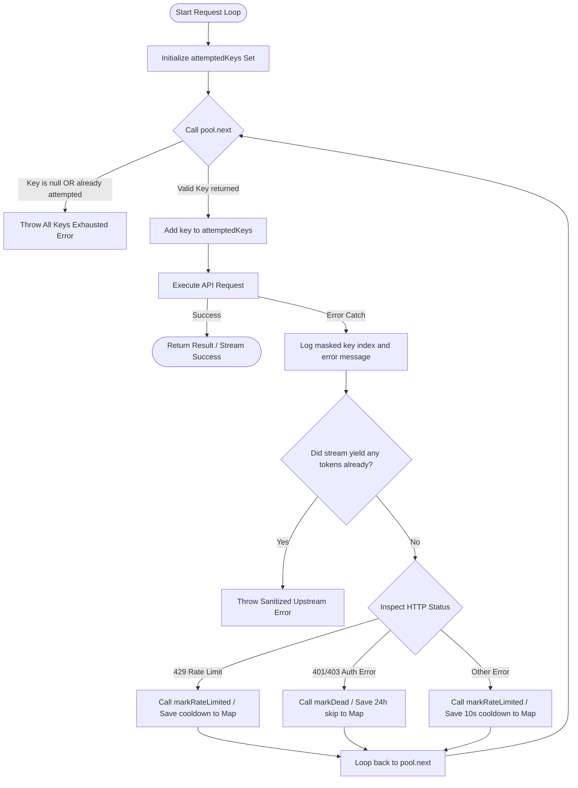

# API Key Looping & Error Handling Architecture

This document maps out the lifecycle and fallback chain for API keys managed by the `KeyPool` class when executing requests (e.g., embeddings or chat completions).

## Architectural Flow Diagram

---

## Detailed Component Roles

### 1. Round-Robin Selection
- **`pool.next()`**: Loops through all keys starting from a moving `cursor` index.
- It checks the in-memory `cooldowns` Map. If the current time is greater than the key's cooldown expiry time, it increments the cursor and returns the key.
- If all keys in the pool are currently cooling down, it returns `null`.

### 2. Stream Interruption Guard (`yieldedAny`)
- If the LLM provider has already begun streaming tokens to the client (i.e. `yieldedAny` became `true`), we **cannot** fallback to another key because the HTTP headers and initial chunk payload have already been flushed to the client.
- In this case, we halt the loop and throw a sanitized user-facing error immediately to prevent client-side SSE parsing issues.

### 3. Cooldown & Death Lifecycles
- **Rate Limits (429):** Reads `Retry-After` header when available. Cooldown is mapped to the exact duration + a safety buffer, after which the key is automatically eligible for round-robin again.
- **Auth Failure (401/403):** Flagged as "dead" and cached with a 24-hour cooldown to avoid wasting requests.
